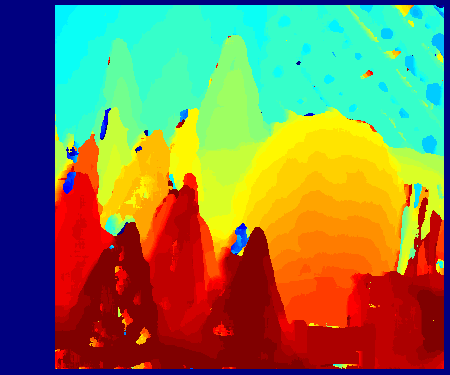
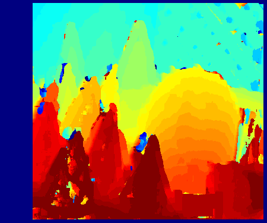
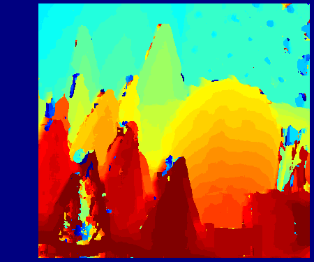
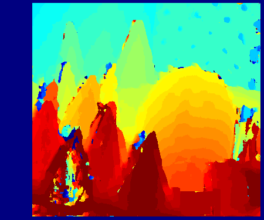
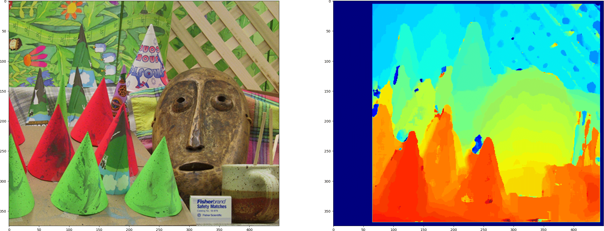

# Disparity Map Library

DisparityMapLib is a Python library for calculating disparity maps using CUDA acceleration for rectified stereo images. It supports multiple cost functions and provides flexibility for your experiments with custom cost functions.


## Features

- CUDA-accelerated disparity calculation
- Support cost functions
  - Sum of Absolute Differences (SAD)
  - Sum of Squared Differences (SSD)
  - Normalized Cross-Correlation (NCC)
  - Zero-mean Normalized Cross-Correlation (ZNCC)

<!-- |SAD|SSD|
|---|---|
|||
|NCC|ZNCC|
||| -->





## Dependencies

- numpy
- numba
- opencv-python
- matplotlib

# Usage example

```
import cv2
import numpy as np
import matplotlib.pyplot as plt
import disparitymaplib as dm

# Load stereo images
img1 = cv2.imread('data/left.png')
img2 = cv2.imread('data/right.png')

# Define disparity range and window size
disp_range = [0, 50]
wind_size = [11, 11]

# Compute disparity map
disparity_map = dm.disparity(img1, img2, disp_range, wind_size, dm.zncc_cuda, dm.max_cost)

# Display the images and the disparity map
fig, ax = plt.subplots(1, 2)
ax[0].imshow(img1[:, :, ::-1])
ax[1].imshow(disparity_map, cmap='jet')
plt.show()

```


